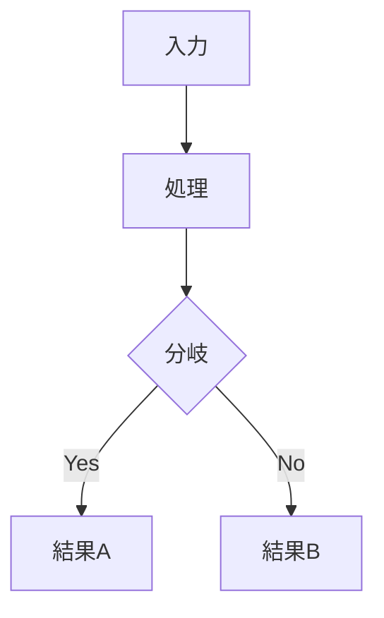

# arch-design — 雛形集（FORMS）

/arch-design の各フェーズで使うテンプレート。SKILL.md から参照される。
コピーして埋める。**埋めるのはメインセッション（設計者）**。サブエージェントには渡さない。

---

## 1. ノード分解表（Phase 1）

設計対象を決定ノードの木に分解し、状態ラベルを付ける。

```markdown
## ノード分解

| ノードID | ノード（決定項目） | 状態 | 依存 | 備考 |
|---------|-------------------|------|------|------|
| N1 | 検索方式 | ❓未決定 | - | リサーチ必要 |
| N2 | 埋め込みモデル | ⚠️依存 | N1 | N1決定後に判断 |
| N3 | レイテンシ要件 | ✅決定済み | - | P95 < 2s |
| … | | | | |

状態: ✅ 決定済み / ❓ 未決定 / ⚠️ 依存
```

---

## 2. 未決定バックログ（Phase 2・常駐更新）

未解決ノードを常時可視化する。設計書の**冒頭**に置き、解決するたびに更新する。

```markdown
## 未決定バックログ

| ノードID | 未決定項目 | 判断基準（何が良い決定か） | 状態 |
|---------|-----------|--------------------------|------|
| N1 | 検索方式 | 遅い→速い。語彙ミスマッチ耐性。運用コスト | リサーチ中 |
| N2 | 埋め込みモデル | 評価セットでの精度・コスト | 待ち（N1依存） |
```

（解決したら行を削除し、決定ログへ移す。）

---

## 3. 選択肢シート（Phase 2・Best of N）

**決定を委ねる前に**、候補を2〜3案生成してトレードオフを対比する。

```markdown
## 選択肢シート: <ノード名（例: 検索方式）>

**判断基準**: <何が「良い決定」か>

| 案 | 方式 | 利点 | 欠点 | トレードオフ |
|----|------|------|------|------------|
| A | ベクトル検索（埋め込み×コサイン） | 意味一致に強い | 埋め込み費用・初期データ必要 | 精度↔初期コスト |
| B | BM25（キーワード） | 実装軽量・解釈容易 | 語彙ミスマッチに弱い | 簡便↔精度 |
| C | ハイブリッド（A+B 融合） | 両者の弱点を補完 | 再ランク実装が複雑 | 精度↔実装複雑度 |

**推奨案**: A（判断基準の「語彙ミスマッチ耐性」に最も応えるため）
```

---

## 4. 決定ログ（Phase 2・固定化）

決定が固まるたびに追記。**「決定・理由・却下案」**を必ず残す（再現性）。

```markdown
## 決定ログ

| ノードID | 決定 | 理由 | 却下案（と理由） | 確定日 |
|---------|------|------|-----------------|--------|
| N3 | レイテンシ要件 P95<2s | 事業要件で規定済み | - | YYYY-MM-DD |
| N1 | 検索方式 = ベクトル検索 | 語彙ミスマッチ耐性が最も重要 | BM25（語彙ミスマッチ）/ ハイブリッド（初期は複雑） | YYYY-MM-DD |
```

---

## 5. 出力テンプレ（Phase 3 — 設計書）

Phase 1〜2 の成果を低認知負荷で整形し、Obsidian `${OBSIDIAN_VAULT}/00-Inbox/YYYY-MM-DD_<件名>_設計書.md` へ出力する。

```markdown
---
title: "<件名> 設計書"
date: YYYY-MM-DD
tags:
  - type/design
  - area/ai
  - status/draft
---

# <件名> 設計書

## 現状の決定サマリー（結論先行）
| ノード | 決定 | 状態 |
|--------|------|------|
| N3 | レイテンシ要件 P95<2s | ✅決定済み |
| N1 | 検索方式 = ベクトル検索 | ✅決定済み |

## 未決定バックログ
（FORMS #2 をここに展開。未解決を隠さない）

## アーキテクチャ


## 決定ログ
（FORMS #4 をここに展開）

## 実装の簡易ロードマップ
（マイルストーン・順序のみ。詳細WBSは /impl-doc）
```

---

## 6. 実装計画書（Phase 4 — 簡易ロードマップ）

```markdown
## 実装の簡易ロードマップ

| フェーズ | 内容 | 完了判定 | 依存 |
|---------|------|---------|------|
| P1 | データ用意・評価セット構築 | 評価セット100件・gold回答付き | - |
| P2 | ベクトル化・インデックス | 検索APIが単体で動作 | P1 |
| P3 | 回答生成・根拠付与 | 根拠なき回答を抑制 | P2 |

→ 詳細WBS（タスク分解・見積り）は `/impl-doc` へ委譲。
```
