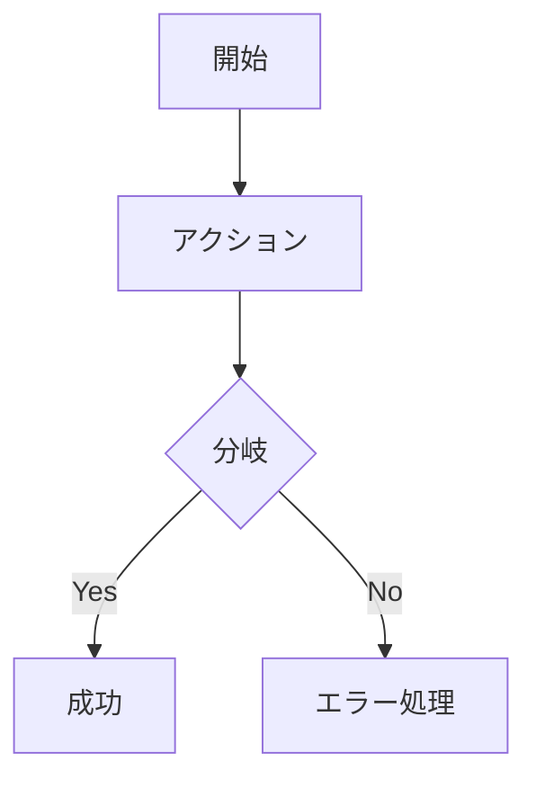
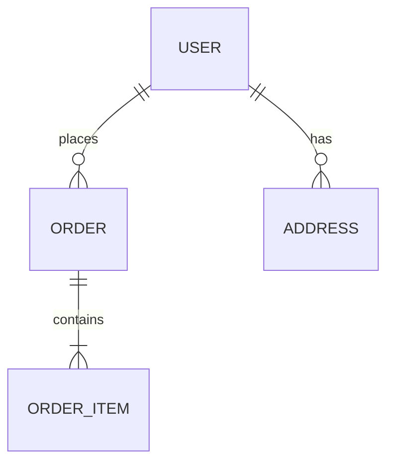

# /design-doc - アイデアから設計書へ

## 概要
漠然としたアイデアを **ガイド付き質問** で深掘りし、実装に移せるレベルの **Markdown設計書** を生成。UI設計ブリーフ・実装計画への分岐もサポート。

## ワークフロー

```
アイデア入力
    ↓
Phase 1: 問題定義 (5-7質問)
    ↓
Phase 2: 解決策探索 (5-7質問)
    ↓
Phase 3: 制約・非機能 (3-5質問)
    ↓
Phase 4: 範囲・マイルストーン (3-5質問)
    ↓
設計書生成 (Markdown)
    ↓
分岐: /ui-brief / /impl-doc
```

## 質問テンプレート

### Phase 1: 問題定義
1. **何を解決するか** - 一文で
2. **誰の問題か** - ペルソナ・ユーザータイプ
3. **現状どう対処しているか** - 既存ワークアラウンド・競合
4. **なぜ今解決すべきか** - 緊急度・機会損失
5. **成功の定義** - 定量指標・定性基準
6. **解決しないこと** - 明示的スコープ外

### Phase 2: 解決策探索
1. **核心的な解決アプローチ** - 技術・UX・プロセス
2. **主要機能・ユーザーフロー** - 3-5個の核心機能
3. **データ・状態モデル** - 主要エンティティ・関係
4. **外部連携・依存** - API・サービス・インフラ
5. **代替案・却下理由** - 検討した他アプローチ

### Phase 3: 制約・非機能
1. **技術制約** - 言語・FW・インフラ・既存資産
2. **パフォーマンス要件** - レイテンシ・スループット・同時接続
3. **セキュリティ・プライバシー** - 認証・暗号化・コンプライアンス
4. **運用・保守性** - デプロイ・監視・ロールバック・ドキュメント
5. **コスト・リソース** - 予算・人員・スケジュール

### Phase 4: 範囲・マイルストーン
1. **MVP範囲** - 最小リリース機能
2. **フェーズ分割** - Phase 1/2/3 の機能・期間
3. **リスク・不確実性** - 技術・外部・組織リスク
4. **依存関係・ブロッカー** - 先行必須タスク
5. **成功判定基準** - 各フェーズの完了定義

## 出力: 設計書テンプレート

```markdown
# 設計書: <プロジェクト名>

## 1. 概要
- **問題**: <Phase 1 Q1>
- **対象ユーザー**: <Phase 1 Q2>
- **解決アプローチ**: <Phase 2 Q1>
- **成功指標**: <Phase 1 Q5>

## 2. ユーザーフロー・機能
### 2.1 主要ユーザーフロー


### 2.2 機能一覧
| ID | 機能名 | 優先度 | Phase | 受け入れ基準 |
|----|--------|--------|-------|-------------|
| F-01 | ユーザー登録 | Must | 1 | メール確認・プロフィール作成 |
| F-02 | ログイン/JWT | Must | 1 | アクセス/リフレッシュトークン |

## 3. データモデル
### 3.1 エンティティ関係図


### 3.2 スキーマ定義 (TypeScript/Prisma/SQL)
```typescript
interface User {
  id: string;
  email: string;
  passwordHash: string;
  profile: Profile;
  createdAt: Date;
}
```

## 4. アーキテクチャ・技術選定
### 4.1 技術スタック
| 層 | 技術 | 選定理由 |
|----|------|----------|
| Frontend | Next.js 14 + TypeScript | 既存資産・SSR・型安全 |
| Backend | NestJS + Prisma | モジュラー・DI・型安全ORM |
| DB | PostgreSQL 16 | 関係データ・拡張性・運用実績 |
| Auth | NextAuth.js + JWT | 標準準拠・柔軟・統合容易 |

### 4.2 アーキテクチャパターン
- **Clean Architecture** / **Modular Monolith** / **Microservices**
- 境界づけられたコンテキスト: Auth / User / Order / Payment

## 5. 非機能要件
| カテゴリ | 要件 | 検証方法 |
|----------|------|----------|
| 性能 | API P95 < 200ms | 負荷試験(k6) |
| 可用性 | 99.9% (月52分) | SLO監視・アラート |
| セキュリティ | OWASP Top 10対策 | SAST/DAST/依存スキャン |
| 拡張性 | 水平スケール可能 | k8s HPA・負荷試験 |

## 6. リスク・対策
| リスク | 影響度 | 可能性 | 対策・軽減 |
|--------|--------|--------|------------|
| 決済API仕様変更 | 高 | 中 | アダプターパターン・モック・契約テスト |
| メール配信遅延 | 中 | 高 | キュー非同期・リトライ・代替チャネル |

## 7. マイルストーン
| Phase | 期間 | 機能 | 完了定義 | 依存 |
|-------|------|------|----------|------|
| 1 | 2週間 | 認証・ユーザー管理 | 登録/ログイン/プロフィール動作 | - |
| 2 | 3週間 | コアドメイン | 注文・在庫・決済フロー | Phase 1 |
| 3 | 2週間 | 管理・運用 | ダッシュボード・通知・ログ | Phase 2 |

## 8. 未決定事項・要確認
- [ ] 決済プロバイダー最終選定 (Stripe vs PAY.JP)
- [ ] メール送信サービス (SendGrid vs SES vs 自前)
- [ ] 多言語対応要否・優先度

---

## コマンド

```
/design-doc                           # 対話式開始
/design-doc "アイデアの概要"            # 初期入力付き開始
/design-doc --from-file=idea.md         # ファイルから開始
/design-doc --skip-phase=3              # フェーズスキップ
/design-doc --output=DESIGN.md          # 出力ファイル指定
/design-doc --format=markdown|json|yaml # 出力形式
```

## 分岐コマンド

| コマンド | 用途 |
|---------|------|
| `/ui-brief` | 設計書からUI設計ブリーフ生成 |
| `/impl-doc` | 設計書から実装計画書生成 |
