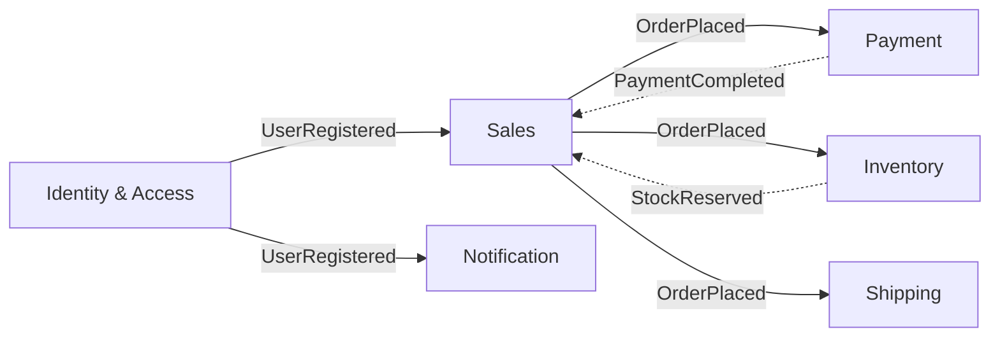

# /domain-model - ドメインモデリング支援

## 概要
プロジェクトの **ドメイン用語・ユビキタス言語・境界づけられたコンテキスト・集約・エンティティ・値オブジェクト・ドメインイベント・リポジトリ** を構造化し、設計ドキュメントとして出力・維持。

## データ構造: `domain-model.json`

```json
{
  "ubiquitous_language": {
    "terms": [
      {"term": "User", "definition": "システムを利用する人。外部IDで識別。", "aliases": ["利用者", "会員"], "context": "identity"},
      {"term": "Order", "definition": "商品購入の意思表示。複数OrderItemを持つ。", "context": "sales"}
    ],
    "contexts": {
      "identity": {"terms": ["User", "Role", "Permission"], "owner": "auth-team"},
      "sales": {"terms": ["Order", "Product", "Payment"], "owner": "commerce-team"}
    }
  },
  "bounded_contexts": [
    {
      "name": "Identity & Access",
      "key": "identity",
      "description": "認証・認可・ユーザー管理",
      "aggregates": ["User", "Role", "Session"],
      "events_published": ["UserRegistered", "RoleAssigned"],
      "events_subscribed": [],
      "team": "platform"
    },
    {
      "name": "Sales",
      "key": "sales",
      "description": "注文・決済・在庫",
      "aggregates": ["Order", "Product", "Cart"],
      "events_published": ["OrderPlaced", "PaymentCompleted"],
      "events_subscribed": ["UserRegistered"],
      "team": "commerce"
    }
  ],
  "aggregates": [
    {
      "name": "Order",
      "context": "sales",
      "root": "Order",
      "entities": ["OrderItem", "ShippingInfo"],
      "value_objects": ["Money", "Address", "OrderStatus"],
      "invariants": ["合計金額=Σ(単価×数量)", "ステータス遷移規則"],
      "domain_events": ["OrderPlaced", "OrderShipped", "OrderCancelled"],
      "repository": "OrderRepository"
    }
  ],
  "domain_services": [
    {"name": "PricingService", "context": "sales", "description": "割引・税計算・送料判定"}
  ],
  "policies": [
    {"name": "FreeShippingPolicy", "rule": "注文金額≥5000円で送料無料", "context": "sales"}
  ]
}
```

## コマンド

### 用語・言語
```
/domain-model term add "Order" --def="購入意思表示" --context=sales --aliases=注文,オーダー
/domain-model term list --context=sales
/domain-model term search "ユーザー"
/domain-model term export --format=markdown --output=UBQUITOUS_LANGUAGE.md
```

### 境界づけられたコンテキスト
```
/domain-model context add "Identity" --key=identity --description="認証認可"
/domain-model context list
/domain-model context map --format=mermaid --output=context-map.mmd
/domain-model context relations --from=identity --to=sales
```

### 集約・エンティティ・値オブジェクト
```
/domain-model aggregate add "Order" --context=sales --root=Order --entities=OrderItem,ShippingInfo --vos=Money,Address,OrderStatus
/domain-model aggregate list --context=sales
/domain-model aggregate show Order --detail
/domain-model aggregate invariants Order --add="合計金額=Σ(単価×数量)"
/domain-model aggregate events Order --add=OrderPlaced,OrderShipped
```

### ドメインサービス・ポリシー
```
/domain-model service add "PricingService" --context=sales --description="価格計算"
/domain-model policy add "FreeShipping" --rule="金額>=5000で送料無料" --context=sales
```

### 出力・ドキュメント生成
```
/domain-model doc --format=markdown --output=DOMAIN_MODEL.md
/domain-model doc --format=openapi --output=domain-api.yaml
/domain-model doc --format=plantuml --output=domain.puml
/domain-model doc --format=ddd-cqrs --output=cqrs-structure/
```

## コンテキストマップ (Mermaid例)



## 設計原則 (DDD準拠)

| 原則 | チェック項目 |
|------|------------|
| **ユビキタス言語** | コード・文書・会話で用語統一 |
| **境界づけられたコンテキスト** | コンテキスト間の明示的マッピング |
| **集約の整合性** | 不変条件・トランザクション境界・イベント発火 |
| **値オブジェクト** | 不変・等価性・副作用なし |
| **ドメインイベント** | 過去形・不変・コンテキスト間通信 |
| **リポジトリ** | 集約ルートのみ・永続化抽象化 |

## 統合・検証

| 検証 | 内容 |
|------|------|
| 用語重複 | 同一コンテキスト内で定義重複なし |
| コンテキスト循環 | イベント依存に循環なし |
| 集約境界 | 不変条件が集約内で完結 |
| イベント整合性 | 公開イベント・購読イベントの型一致 |
| リポジトリ | 集約ルートのみリポジトリ存在 |

## オプション

| オプション | 説明 |
|-----------|------|
| `--context` | 対象コンテキスト指定 |
| `--format` | 出力形式: md/mermaid/plantuml/openapi/json |
| `--validate` | 整合性検証実行 |
| `--team` | チーム別フィルタ |

---

*移行日: 2026-07-27 | 元: CmdC domain-modeling skill*