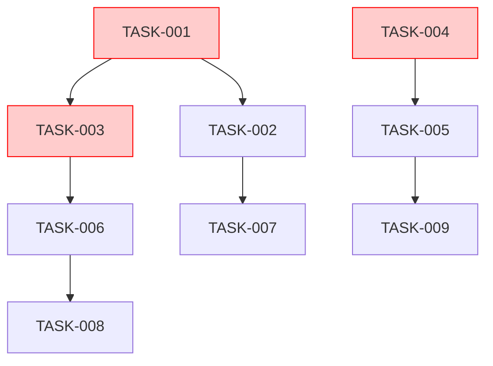

# /impl-doc - 実装計画書生成

## 概要
設計書を受け取り、**類似製品・技術調査 → タスク分解 → 依存関係マッピング → リスク評価 → マイルストーン設定** の実装計画書を生成。

## 入力
- **必須**: 設計書 (`/design-doc` または `/design-doc` 互換Markdown)
- **任意**: 既存コードベース・技術スタック決定事項・チーム体制・予算・期限

## ワークフロー

```
設計書入力
    ↓
Phase 1: 類似製品・技術調査 (自動Web/学術/GitHub検索)
    ├─ 競合・OSS・SaaS比較
    ├─ 技術選定根拠・ベンチマーク
    └─ 既知課題・回避策収集
    ↓
Phase 2: 実装タスク分解 (WBS: Work Breakdown Structure)
    ├─ エピック → フィーチャー → タスク → サブタスク
    ├─ 見積もり (時間・複雑度・不確実性)
    └─ 担当・スキル要件マッピング
    ↓
Phase 3: 依存関係・クリティカルパス
    ├─ タスク間依存グラフ構築
    ├─ 並列実行可能グループ特定
    └─ クリティカルパス・ボトルネック算出
    ↓
Phase 4: リスク評価・軽減策
    ├─ 技術・外部・組織リスク洗い出し
    ├─ 影響度×確率マトリクス
    └─ 軽減策・コンティンジェンシー
    ↓
Phase 5: マイルストーン・リリース計画
    ├─ MVP / Phase 1/2/3 範囲確定
    ├─ リリース基準・ロールバック基準
    └─ ステークホルダー報告サイクル
    ↓
実装計画書出力
```

## 出力構成

### 1. 技術選定・調査サマリ

| 領域 | 採用技術 | 選定根拠 | 代替案 | リスク |
|------|---------|----------|--------|--------|
| Frontend | Next.js 14 + TS | 既存資産・SSR・App Router成熟 | Remix, Astro | App Router学習コスト |
| Backend | NestJS + Prisma | モジュラー・DI・型安全ORM | Fastify+tRPC, Go | Prismaパフォーマンス |
| DB | PostgreSQL 16 | 関係データ・JSONB・拡張性 | MySQL, PlanetScale | 接続数・マイグレーション |
| Auth | NextAuth.js v5 | 標準準拠・柔軟・統合容易 | Clerk, Supabase Auth | カスタマイズ複雑性 |
| Deploy | Vercel + Neon | DX・プレビュー・サーバレス | AWS ECS, Railway | コールドスタート・コスト |
| Monitoring | Sentry + PostHog | エラー・プロダクト分析統合 | Datadog, Grafana | データ保持・コスト |

### 2. WBS (タスク分解)

```markdown
## EPIC: 認証・ユーザー基盤 (EPIC-AUTH)
### FEATURE: ユーザー登録 (FEAT-REGISTER)
- [ ] TASK-001: メール/パスワード登録API (8h, 高複雑度)
  - SUB-001: バリデーションスキーマ (Zod)
  - SUB-002: パスワードハッシュ (argon2id)
  - SUB-003: メール確認トークン生成・送信
  - SUB-004: 重複チェック・エラーハンドリング
- [ ] TASK-002: 登録フロントエンド (6h, 中複雑度)
  - SUB-005: フォーム・バリデーション (React Hook Form + Zod)
  - SUB-005: 送信中/エラー/成功状態UI
  - SUB-006: 完了後リダイレクト・オンボーディング遷移

### FEATURE: ログイン/JWT (FEAT-LOGIN)
- [ ] TASK-003: 認証API (10h, 高複雑度)
  - SUB-007: 認証・アクセストークン発行 (JWT RS256)
  - SUB-008: リフレッシュトークン・ローテーション
  - SUB-009: デバイスフィンガープリント・セッション管理
  - SUB-010: 多要素認証 (TOTP) 基盤
```

### 3. 依存関係グラフ (Mermaid)



### 4. クリティカルパス・並列グループ

| グループ | タスク | 並列可否 | 期間 | クリティカル |
|----------|--------|---------|------|-------------|
| G1: 認証基盤 | TASK-001, TASK-003, TASK-004 | 並列実行可 | 3日 | ✅ |
| G2: フロント認証 | TASK-002, TASK-005, TASK-007 | G1完了後並列 | 2日 | ✅ |
| G3: プロフィール | TASK-006, TASK-008 | G2完了後並列 | 1.5日 | - |
| G4: 管理機能 | TASK-009, TASK-010 | G3完了後 | 2日 | - |

**クリティカルパス**: G1 (3日) → G2 (2日) → G3 (1.5日) = **6.5日**

### 5. リスクマトリクス

| リスクID | リスク内容 | 影響度 | 確率 | スコア | 軽減策 | コンティンジェンシー |
|---------|-----------|--------|------|--------|--------|-------------------|
| RISK-01 | NextAuth v5破壊的変更 | 高 | 中 | 15 | v4フォールバック準備・型定義自前 | +2日 |
| RISK-02 | Prismaマイグレーション失敗 | 高 | 低 | 10 | ステージング検証・ロールバック手順書 | +1日 |
| RISK-03 | Vercel関数実行時間制限 | 中 | 高 | 12 | エッジ関数分割・ストリーミング | アーキ変更 |
| RISK-04 | メール配信遅延・到達率 | 中 | 高 | 12 | キュー非同期・プロバイダー複数・リトライ | - |
| RISK-05 | 型定義・スキーマ不整合 | 中 | 中 | 9 | 契約テスト・生成自動化・CI必須 | +0.5日 |

### 6. マイルストーン・リリース計画

| マイルストーン | 期間 | 範囲 | 完了基準 | ステークホルダー報告 |
|---------------|------|------|----------|---------------------|
| M1: 認証MVP | Week 1-2 | 登録・ログイン・JWT・プロフィール | E2Eテスト通過・手動確認 | Week 2末 デモ |
| M2: コアドメイン | Week 3-5 | 注文・在庫・決済・通知 | 負荷試験・セキュリティ監査 | Week 4中間/Week 5末 |
| M3: 管理・運用 | Week 6-7 | ダッシュボード・ログ・設定・API文書 | 内部ユーザー受入テスト | Week 7末 デモ |
| M4: 本番リリース | Week 8 | カナリア→全ユーザー | エラー率<0.1%・P95<200ms | リリースノート・事後レビュー |

### 7. チーム・リソース配分

| ロール | 人数 | 担当エピック | 稼働率 | スキルギャップ |
|--------|------|-------------|--------|----------------|
| Tech Lead | 1 | 全体・アーキ・レビュー | 100% | - |
| Backend | 2 | AUTH, CORE, ADMIN | 100% | Prisma上級 |
| Frontend | 2 | AUTH, CORE, ADMIN | 100% | Next.js 14 App Router |
| QA/DevOps | 1 | CI/CD・テスト・監視 | 50% | k6負荷試験 |

## コマンド

```
/impl-doc <設計書ファイル>               # 実装計画生成
/impl-doc --design=DESIGN.md --output=IMPL_PLAN.md
/impl-doc --team-size=5 --duration=8w    # チーム・期間指定
/impl-doc --risk-threshold=high          # 高リスクのみ詳細
/impl-doc --format=markdown|json|gantt   # ガントチャート出力
/impl-doc --skip-research                # 調査スキップ (技術決定済み時)
```

## 統合連携

| ツール | 連携内容 |
|--------|----------|
| `/design-doc` | 入力元・設計書 |
| `/tdd` | タスク単位でTDD実行 |
| `/code-review` | 実装時レビュー基準 |
| GitHub Projects / Linear | タスク同期・進捗管理 |
| Notion / Obsidian | 計画書・議事録連携 |
