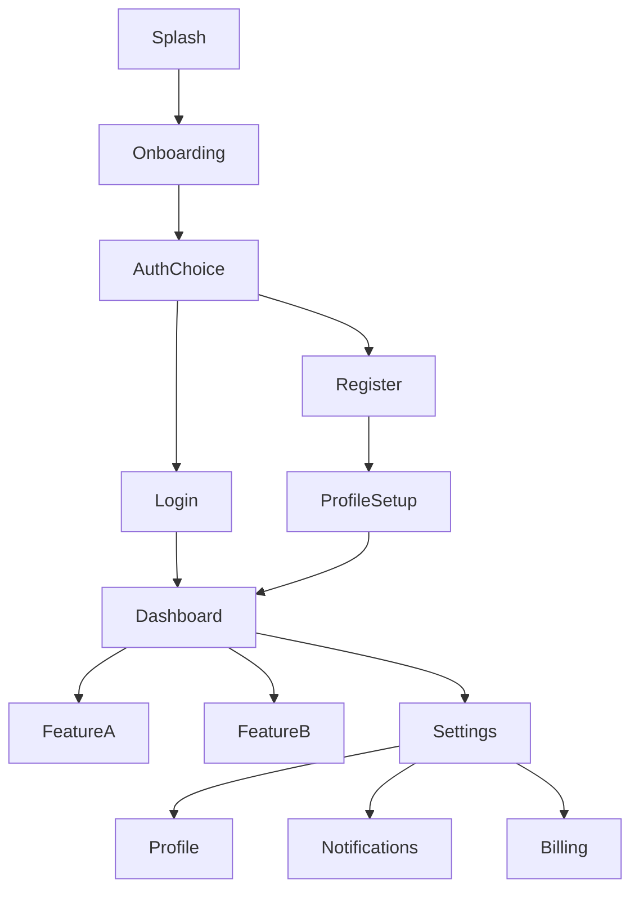

# /ui-brief - UI設計ブリーフ生成

## 概要
設計書 (`/design-doc` 出力等) から **UI設計ブリーフ** を生成。画面遷移図・ワイヤーフレーム指示・コンポーネント分解・デザイントークン・アクセシビリティ要件まで網羅。

## 入力・前提
- **必須**: 設計書Markdown (設計概要・ユーザーフロー・データモデル・機能一覧)
- **任意**: ブランドガイドライン・既存デザインシステム・ユーザビリティテスト結果

## ワークフロー

```
設計書入力
    ↓
Phase 1: 画面・遷移抽出 (ユーザーフロー→画面マップ)
    ↓
Phase 2: コンポーネント分解 (画面→原子/分子/有機体/テンプレート/ページ)
    ↓
Phase 3: 状態・インタラクション定義 (各画面の状態遷移・イベント)
    ↓
Phase 4: デザイントークン・スタイルガイド (色・タイポ・スペース・影・動き)
    ↓
Phase 5: アクセシビリティ・レスポンシブ要件
    ↓
UI設計ブリーフ出力 (Markdown + Mermaid + Figma連携JSON)
```

## 出力構成

### 1. 画面遷移マップ (Mermaid)



### 2. 画面定義一覧

| 画面ID | 画面名 | ルート | 親画面 | 遷移トリガー | 必須データ | 権限 |
|--------|--------|--------|--------|-------------|--------|-----------|------|
| SC-01 | スプラッシュ | `/` | - | アプリ起動 | - | Public |
| SC-02 | オンボーディング | `/onboarding` | Splash | 初回起動 | - | Public |
| SC-03 | 認証選択 | `/auth` | Onboarding | 完了 | - | Public |
| SC-04 | ログイン | `/login` | AuthChoice | メール/パスワード | 認証情報 | Public |
| SC-05 | ダッシュボード | `/dashboard` | Login/Register | 認証成功 | ユーザー・統計 | Auth |

### 3. コンポーネント分解 (Atomic Design)

#### Atoms (原子)
| 名前 | 用途 | Props | バリアント | 状態 |
|------|------|-------|-----------|------|
| Button | アクション | label, onClick, disabled | primary/secondary/ghost/danger | hover/active/disabled/loading |
| Input | 入力 | value, onChange, error, label | text/email/password/search | focus/error/disabled |
| Icon | 装飾・操作 | name, size, color | outline/filled | - |
| Badge | 状態表示 | label, count | default/success/warning/danger | - |
| Avatar | ユーザー表示 | src, alt, fallback | sm/md/lg/xl | loading/error |

#### Molecules (分子)
| 名前 | 構成Atoms | 用途 |
|------|----------|------|
| SearchBar | Input + Icon + Button | ヘッダー検索 |
| FormField | Label + Input + ErrorText | フォーム項目 |
| UserMenu | Avatar + Dropdown + Button | ヘッダーユーザーメニュー |
| Card | Container + Image + Text + Button | コンテンツカード |
| TabBar | Button群 + Indicator | ナビゲーション |

#### Organisms (有機体)
| 名前 | 構成Molecules | 用途 |
|------|--------------|------|
| Header | Logo + SearchBar + UserMenu | 全画面共通ヘッダー |
| Sidebar | NavList + UserProfile | ダッシュボードサイドバー |
| DataTable | Header + Row群 + Pagination | 一覧画面メイン |
| FormWizard | Stepper + FormField群 | 複数ステップフォーム |

#### Templates (テンプレート)
| 名前 | 構成Organisms | 適用画面 |
|------|--------------|----------|
| AuthLayout | Header + FormWizard | Login/Register |
| DashboardLayout | Header + Sidebar + Content | Dashboard/Feature/Settings |
| ModalLayout | Overlay + Container | 確認・設定モーダル |

### 4. デザイントークン

```json
{
  "color": {
    "primary": { "50": "#eff6ff", "100": "#dbeafe", "500": "#3b82f6", "600": "#2563eb", "900": "#1e3a8a" },
    "neutral": { "0": "#ffffff", "50": "#fafafa", "100": "#f5f5f5", "500": "#737373", "900": "#171717" },
    "semantic": { "success": "#10b981", "warning": "#f59e0b", "danger": "#ef4444", "info": "#3b82f6" }
  },
  "typography": {
    "fontFamily": { "sans": "Inter, system-ui, sans-serif", "mono": "JetBrains Mono, monospace" },
    "fontSize": { "xs": "0.75rem", "sm": "0.875rem", "base": "1rem", "lg": "1.125rem", "xl": "1.25rem", "2xl": "1.5rem", "3xl": "1.875rem", "4xl": "2.25rem" },
    "fontWeight": { "normal": 400, "medium": 500, "semibold": 600, "bold": 700 },
    "lineHeight": { "tight": 1.25, "normal": 1.5, "relaxed": 1.75 }
  },
  "spacing": { "0": "0", "1": "0.25rem", "2": "0.5rem", "3": "0.75rem", "4": "1rem", "6": "1.5rem", "8": "2rem", "12": "3rem", "16": "4rem" },
  "borderRadius": { "none": "0", "sm": "0.25rem", "md": "0.375rem", "lg": "0.5rem", "xl": "0.75rem", "full": "9999px" },
  "shadow": { "sm": "0 1px 2px 0 rgb(0 0 0 / 0.05)", "md": "0 4px 6px -1px rgb(0 0 0 / 0.1)", "lg": "0 10px 15px -3px rgb(0 0 0 / 0.1)" },
  "transition": { "fast": "150ms ease", "normal": "200ms ease", "slow": "300ms ease" },
  "breakpoints": { "sm": "640px", "md": "768px", "lg": "1024px", "xl": "1280px", "2xl": "1536px" }
}
```

### 5. アクセシビリティ要件

| 基準 | レベル | 実装項目 |
|------|--------|----------|
| **WCAG 2.1** | AA | コントラスト4.5:1・フォーカス可視・キーボード操作・ARIAラベル |
| **セマンティックHTML** | - | heading階層・landmark・form label・table header |
| **レスポンシブ** | - | 320px〜・タッチターゲット44px・横スクロール禁止 |
| **モーション** | - | prefers-reduced-motion対応・自動再生停止 |
| **フォーム** | - | エラー表示・必須マーク・入力支援・送信前確認 |

## コマンド

```
/ui-brief <設計書ファイル>              # 設計書から生成
/ui-brief --from-design=DESIGN.md       # 明示指定
/ui-brief --output=UI_BRIEF.md          # 出力ファイル
/ui-brief --format=markdown|figma|json  # 出力形式
/ui-brief --tokens-only                 # デザイントークンのみ
/ui-brief --components-only             # コンポーネントのみ
/ui-brief --a11y-check                  # アクセシビリティチェックのみ
```

## Figma連携 (--format=figma)

```json
{
  "name": "Project UI Brief",
  "pages": [
    {"name": "Screens", "frames": [...]},
    {"name": "Components", "frames": [...]},
    {"name": "Tokens", "frames": [...]}
  ],
  "styles": {
    "colors": [...],
    "textStyles": [...],
    "effectStyles": [...],
    "gridStyles": [...]
  }
}
```
